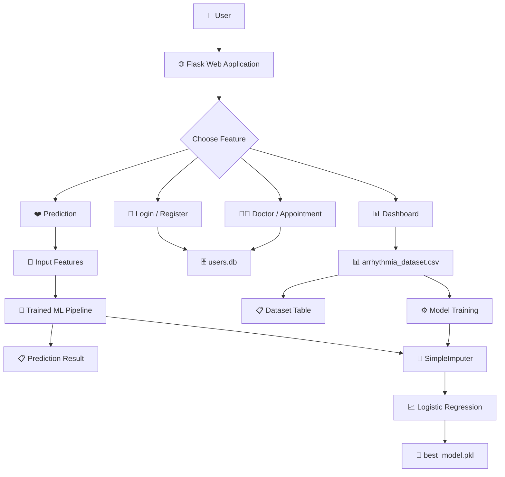

# ❤️ Arrhythmia AI

<p align="center">
  <b>🫀 AI-Based Heart Health & Arrhythmia Detection System</b>
</p>

<p align="center">
  
  
  
  
  
</p>

---

## 🌟 Overview

**Arrhythmia AI** is a web-based machine learning application designed to provide an AI-assisted prediction of whether a submitted set of heart-related features is associated with an **arrhythmia** or a **normal** result.

The project combines a **Flask web application**, **Scikit-learn machine learning pipeline**, **SQLite database**, HTML templates, and a **Power BI dashboard file**.

Along with prediction, the application provides supporting features such as:

- ❤️ Heart-health information
- 🤖 Arrhythmia prediction
- 👤 User registration and login
- 👨‍⚕️ Doctor/appointment booking
- 📊 Dataset dashboard
- 🚪 Logout functionality

> ⚠️ **Important:** This project is an academic/demo prediction system. Its prediction should not be treated as a medical diagnosis or a replacement for professional medical advice.

---

## ✨ Key Features

### ❤️ 1. Arrhythmia Prediction

The application provides a prediction page where the user enters five feature values.

The backend:

1. Reads the submitted values.
2. Converts them into numeric values.
3. Creates a model input array.
4. Pads the remaining features with zeros when required by the trained model.
5. Sends the input to the trained machine learning model.
6. Displays either:

```text
⚠️ Arrhythmia Detected
```

or

```text
✅ Normal
```

---

### 🤖 2. Machine Learning Pipeline

The model is trained using the dataset:

```text
arrhythmia_dataset.csv
```

The training pipeline uses:

- 🧹 `SimpleImputer(strategy="mean")`
- 📈 `LogisticRegression(max_iter=1000)`
- 🔗 Scikit-learn `Pipeline`

The trained pipeline is saved as:

```text
best_model.pkl
```

When the application starts:

```text
arrhythmia_dataset.csv
        │
        ▼
   📊 Features + Target
        │
        ▼
🧹 Missing Value Imputation
        │
        ▼
📈 Logistic Regression
        │
        ▼
best_model.pkl
```

If `best_model.pkl` does not exist, the application trains the model automatically.

---

### 👤 3. User Registration & Login

The application includes:

- 📝 User registration
- 🔐 Login
- 🚪 Logout
- 💾 SQLite-based user storage

User information is stored in:

```text
users.db
```

The database contains a `users` table with:

| Column | Description |
|---|---|
| `id` | Auto-increment user ID |
| `username` | User name |
| `password` | User password |

---

### 👨‍⚕️ 4. Doctor & Appointment Booking

Users can access the doctor page and submit:

- 👤 Name
- 👨‍⚕️ Doctor
- 📅 Appointment date

Appointment information is stored in the SQLite database.

The application creates an:

```text
appointments
```

table containing:

| Column | Description |
|---|---|
| `id` | Appointment ID |
| `name` | User name |
| `doctor` | Selected doctor |
| `date` | Appointment date |

---

### 📊 5. Dashboard

The dashboard displays the first 10 rows of the arrhythmia dataset as an HTML table.

The data is generated using:

```python
df.head(10).to_html(
    classes="table table-striped",
    index=False
)
```

The project also contains:

```text
finalyeardash.pbix
```

which is a Power BI dashboard file associated with the project.

---

## 🏗️ System Architecture



---

## 🔄 Prediction Workflow

```text
             👤 User
                │
                ▼
       ❤️ Prediction Page
                │
                ▼
       🔢 Enter 5 Features
                │
                ▼
          Flask Backend
                │
                ▼
       Convert Input → Array
                │
                ▼
      Add Missing Features
          with Zero Padding
                │
                ▼
       🤖 best_model.pkl
                │
                ▼
       📈 Logistic Regression
                │
          ┌─────┴─────┐
          ▼           ▼
       Result = 1   Result = 0
          │           │
          ▼           ▼
     ⚠️ Arrhythmia   ✅ Normal
        Detected
```

---

## 🧠 Machine Learning Workflow

The model is trained from:

```text
arrhythmia_dataset.csv
```

The code treats:

```python
X = df.iloc[:, :-1]
y = df.iloc[:, -1]
```

Therefore:

- `X` contains all columns except the last column.
- `y` contains the last column as the target.

The pipeline is:

```python
Pipeline([
    ("imputer", SimpleImputer(strategy="mean")),
    ("model", LogisticRegression(max_iter=1000))
])
```

The trained pipeline is stored using Joblib:

```text
best_model.pkl
```

---

## 🛠️ Tech Stack

### 🐍 Backend

- **Python**
- **Flask**
- **Pandas**
- **NumPy**

### 🤖 Machine Learning

- **Scikit-learn**
- **Logistic Regression**
- **SimpleImputer**
- **Pipeline**
- **Joblib**

### 🌐 Frontend

- **HTML**
- **CSS**
- **Bootstrap 5**
- **Jinja2 Templates**

### 🗄️ Database

- **SQLite**

### 📊 Analytics

- **Power BI**

---

## 📁 Project Structure

```text
Prediction-of-Arrthymia.io-main/
│
├── 📄 app.py
│
├── 📊 arrhythmia_dataset.csv
├── 📊 arrhythmia_predictions.csv
├── 🤖 best_model.pkl
│
├── 🗄️ database.db
├── 🗄️ users.db
│
├── 📊 finalyeardash.pbix
│
├── 📂 static/
│   └── style.css
│
└── 📂 templates/
    ├── index.html
    ├── login.html
    ├── register.html
    ├── dashboard.html
    ├── predict.html
    ├── doctors.html
    ├── booking.html
    └── chatboat.html
```

---

## 📌 Main Components

| File / Folder | Purpose |
|---|---|
| `app.py` | Main Flask application, ML logic, routes, login, booking and prediction |
| `arrhythmia_dataset.csv` | Dataset used for model training and dashboard display |
| `arrhythmia_predictions.csv` | Prediction-related CSV data included with the project |
| `best_model.pkl` | Saved Scikit-learn ML pipeline |
| `users.db` | SQLite database for registered users and appointments |
| `database.db` | SQLite database file included in the project |
| `finalyeardash.pbix` | Power BI dashboard |
| `templates/` | HTML/Jinja web pages |
| `static/style.css` | Custom styling |

---

## 🚀 Getting Started

### 📌 Prerequisites

Install the following:

- 🐍 Python 3.10+
- 📦 pip
- 🌐 A modern web browser

---

## ⚙️ Installation

### 1️⃣ Clone the repository

```bash
git clone <your-repository-url>
cd Prediction-of-Arrthymia.io-main
```

### 2️⃣ Create a virtual environment

#### Windows

```bash
python -m venv venv
venv\Scripts\activate
```

#### macOS / Linux

```bash
python3 -m venv venv
source venv/bin/activate
```

### 3️⃣ Install dependencies

```bash
pip install flask pandas numpy scikit-learn joblib
```

---

## ▶️ Run the Application

Start the Flask server:

```bash
python app.py
```

The application will normally be available at:

```text
http://127.0.0.1:5000
```

Open the URL in your browser.

---

## 🖥️ Application Pages

### 🏠 Home

The home page provides access to the major features:

```text
🏠 Home
📊 Dashboard
👨‍⚕️ Doctors
❤️ Prediction
🔐 Login
```

### 🔐 Login

Users can enter:

- Username
- Password

### 📝 Register

New users can create an account using:

- Username
- Password

### ❤️ Prediction

The prediction page accepts five numeric feature values and returns the model result.

### 👨‍⚕️ Doctors

Users can enter their name, select a doctor, and choose an appointment date.

### 📊 Dashboard

The dashboard displays sample rows from the arrhythmia dataset.

---

## 🧪 Example Prediction Flow

```text
Input:

Feature 1 → 52
Feature 2 → 80
Feature 3 → 120
Feature 4 → 75
Feature 5 → 60

          ↓

🤖 Machine Learning Model

          ↓

┌────────────────────────────┐
│ ⚠️ Arrhythmia Detected     │
│            OR              │
│ ✅ Normal                  │
└────────────────────────────┘
```

> The actual result depends on the trained model and input values.

---

## 📊 Data & Analytics

The project contains multiple data and analytics resources:

### 📄 Dataset

```text
arrhythmia_dataset.csv
```

Used for:

- Model training
- Dataset visualization

### 📄 Predictions

```text
arrhythmia_predictions.csv
```

Included as a prediction-related data file.

### 📊 Power BI

```text
finalyeardash.pbix
```

This Power BI file can be opened using **Microsoft Power BI Desktop**.

---

## 🔐 Security Notes

This project is currently structured as an academic/demo application and should be improved before production deployment.

### ⚠️ Password Storage

The current application stores passwords directly in SQLite.

For a production application, passwords should be:

- 🔒 Hashed
- 🧂 Salted
- 🔐 Never stored as plain text

### ⚠️ Flask Secret Key

The current source contains:

```python
app.secret_key = "secret123"
```

For deployment, this should be moved to a secure environment variable.

### ⚠️ Debug Mode

The application currently runs with Flask debug mode enabled:

```python
app.run(debug=True)
```

Debug mode should be disabled in production.

---

## 🩺 Medical Disclaimer

> ⚠️ **This application is for educational and demonstration purposes only.**

The prediction generated by this project should **not** be used as a medical diagnosis.

If someone is experiencing symptoms or has concerns about heart health, they should consult a qualified healthcare professional.

---

## 🚧 Future Improvements

### 🤖 Machine Learning

- 📈 Add model performance metrics
- 🎯 Compare Logistic Regression with Random Forest, SVM, XGBoost, etc.
- 📊 Add confusion matrix and classification report
- 📉 Add ROC-AUC analysis
- 🔍 Add feature importance/explainability
- 🧪 Add proper train/test validation

### ❤️ Healthcare Features

- 📋 Store prediction history per user
- 📈 Display personal prediction trends
- 🫀 Add ECG-based analysis
- 🚨 Add health-risk alerts
- 📄 Generate downloadable reports

### 👨‍⚕️ Doctor Features

- 👨‍⚕️ Doctor profiles
- 📅 Appointment time slots
- 🔔 Appointment notifications
- 📋 Doctor-side patient history

### 🔐 Security

- 🔒 Password hashing
- 🔑 Secure session management
- 🛡️ Environment-based secret keys
- 👥 Role-based authentication

### 📊 Analytics

- 📈 Improve Power BI dashboard
- 📊 Add interactive prediction analytics
- 🔎 Add demographic and feature-based analysis

---

## 🎯 Project Goal

The goal of **Arrhythmia AI** is to demonstrate how machine learning can be integrated into a web application to provide an AI-assisted heart-health prediction workflow.

```text
📊 Medical Dataset
       │
       ▼
🧹 Data Processing
       │
       ▼
🤖 Machine Learning
       │
       ▼
🌐 Flask Web Application
       │
       ▼
❤️ Prediction
       │
       ▼
📊 Analytics & Supporting Services
```

---

## 🔮 Project Vision

The project can be extended into a more complete digital heart-health platform:

```text
                  ❤️ Arrhythmia AI
                        │
       ┌────────────────┼────────────────┐
       ▼                ▼                ▼
   🤖 Prediction    👨‍⚕️ Doctors      📊 Analytics
       │                │                │
   ML Analysis      Appointment       Power BI
       │                │                │
       └────────────────┼────────────────┘
                        ▼
                 🩺 Health Support
```

---

## 📌 Current Scope

The uploaded project currently contains:

```text
✅ Flask web application
✅ Arrhythmia dataset
✅ Logistic Regression pipeline
✅ Missing-value imputation
✅ Saved ML model
✅ User registration
✅ User login
✅ Appointment booking
✅ Prediction page
✅ Dashboard page
✅ Power BI dashboard file
✅ HTML/CSS interface
```

The repository also contains a `chatboat.html` template, but the active `app.py` shown in the project does not currently define a `/chatbot` route.

---

## 👨‍💻 Project

**Arrhythmia AI – AI-Based Heart Health Detection System**

Built with:

`Python` • `Flask` • `Scikit-learn` • `Pandas` • `NumPy` • `SQLite` • `Bootstrap` • `Power BI`

> ❤️ **Predict. Analyze. Understand.**

---

<p align="center">
  ⭐ If you find this project useful, consider giving it a star!
</p>
